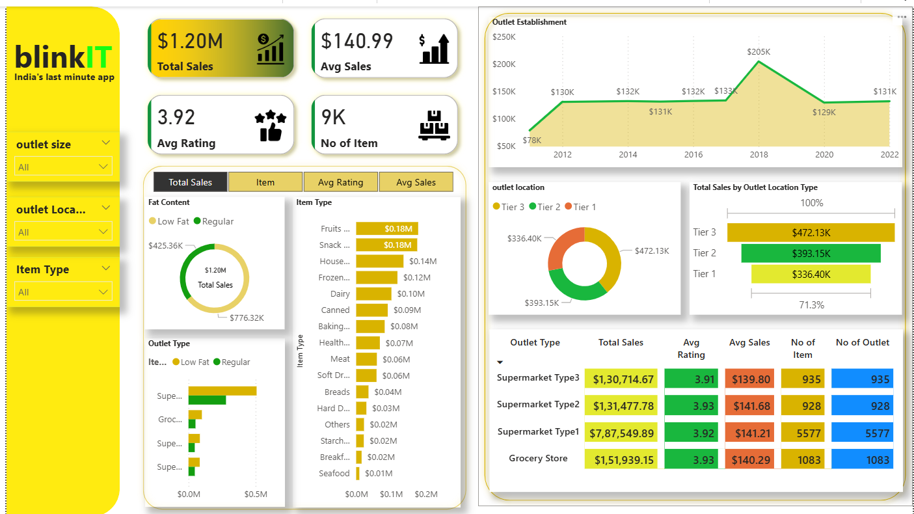

# 🛒 Blinkit Store Data Analysis Project

This project analyzes the sales, ratings, and outlet performance of Blinkit stores using SQL and Power BI. It provides insights into item sales, outlet types, fat content categories, item visibility, and more.

## 📁 Files Included

- `BlinkIT Grocery Data.xlsx` - Raw dataset used for SQL queries and dashboard.
- `blinkit_data_analysis_queries.sql` - SQL queries used in the analysis.
- `output.docx` - Document with queries and their outputs.
- `Dashboard.png` - Screenshot of the final Power BI dashboard.
- `PowerBI_Dashboard.pbix` *(optional)* - Editable Power BI file.

## 🛠 Tools Used

- **SQL (MySQL)** – for querying and analyzing the dataset.
- **Microsoft Power BI** – for data visualization.
- **Excel** – for initial data cleaning and exploration.

## 📊 Key Insights

- Total Sales: **$1.20M**
- Average Rating: **3.92**
- Top Sales by Outlet Location Type: **Tier 3 ($472.13K)**
- Top Performing Item Types: **Fruits, Snacks, Household items**
- Sales Trends by Establishment Year reveal spikes around 2018.

## 📌 Sample SQL Query

```sql
SELECT `Item Type`, round(SUM(sales),2) AS Total_sales
FROM stores
GROUP BY `Item Type`
ORDER BY Total_sales DESC
LIMIT 5;
```

## 📷 Dashboard Preview



## 👨‍💻 Author

- **Shivam Kumar Sharma**  
  Data Analyst | SQL | Power BI | Excel

---

Feel free to fork or use this project for learning and portfolio purposes.
